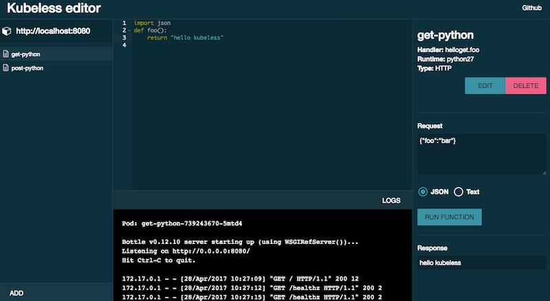

# kubeless-ui

[](https://circleci.com/gh/kubeless/kubeless-ui/tree/master)
[](http://slack.oss.bitnami.com)

Graphical User Interface for [Kubeless](https://github.com/kubeless/kubeless), a serverless framework for Kubernetes.

## In-Cluster Installation

To run the UI inside your Kubernetes cluster as a Deployment and Service you can run the following:

```bash
kubectl create -f https://raw.githubusercontent.com/kubeless/kubeless-ui/master/k8s.yaml
```

These are known to work on minikube, they may need a few tweaks if you have RBAC turned on (docs coming soon).

## Development

Project based on [davezuko/react-redux-starter-kit](https://github.com/davezuko/react-redux-starter-kit)

Install dependencies It is recommended that you use [Yarn](https://yarnpkg.com/) for deterministic installs.

```bash
yarn install    # Install project dependencies
yarn run dev    # Launch and watch server
```

*(`npm` will also work if you really want)*

Dev server with Hot Module Replacement should run at http://localhost:3000

## Production

You can bundle the app in `dist/` folder

This will also run linter and tests.

```bash
yarn run build
```

Now you just have to serve the `dist/` folder with node (`yarn run start`) or with an nginx.

## Docker image
Exists and automated build that you can find on DockerHub, Quay.io and Gcloud Registry
by his name:  bitnami/kubeless-ui

## Snapshot


